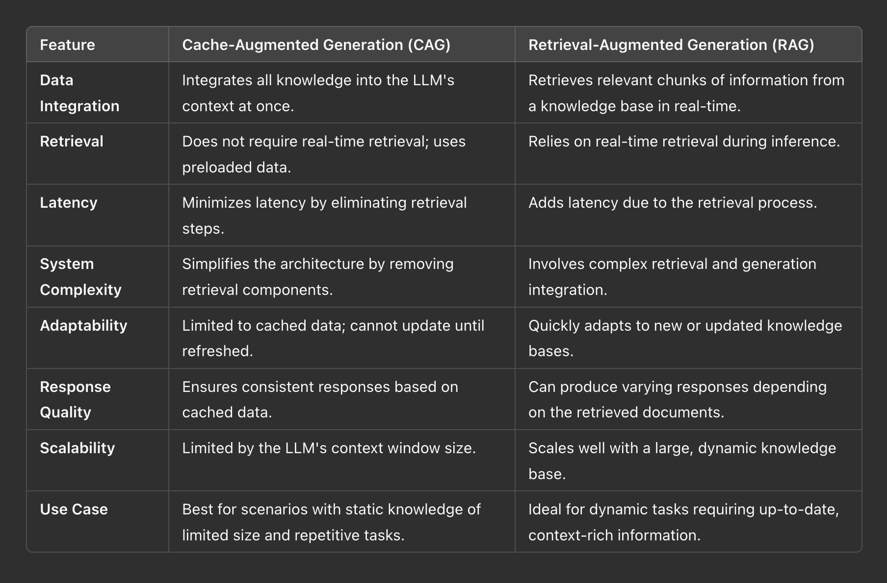

# Cache-Augmented-Generation-Granite
This repository explores Cache Augmented Generation (CAG) and its usage with Granite language models, demonstrating how Granite’s extended context windows and processing power enhance efficiency by directly utilizing precomputed information.

Unlike Retrieval-Augmented Generation (RAG), which dynamically fetches relevant chunks of information in real-time followed by response generation, CAG prepares and stores all necessary information in advance.

## CAG vs. RAG: Key differences


<br>

# SetUp Guide

- **Clone the Repository:**
  ```bash
  git clone https://github.com/IBM/Cache-Augmented-Generation-Granite.git
  cd Cache-Augmented-Generation-Granite
  ```

- **Create and Activate Virtual Environment:**
  ```bash
  uv venv --python=3.11
  source .venv/bin/activate
  ```

- **Install Dependencies:**
  ```bash
  uv sync
  ```

- **Configure Environment Variables:**
  ```bash
  cp .env.sample .env
  ```
  - Update `.env` with your Hugging Face token:
    ```bash
    HF_TOKEN=<your_hf_token>
    ```
  - You can get your Hugging Face token from [Hugging Face](https://huggingface.co/settings/tokens).

- **Run the Script:**
  ```bash
  python cag_script.py
  ```

## Reference
- Research paper: [Don’t Do RAG: When Cache-Augmented Generation is All You Need for Knowledge Tasks](https://arxiv.org/abs/2412.15605v1)